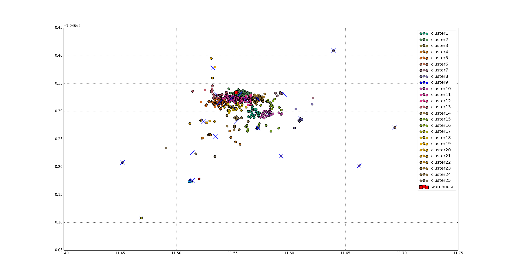

# Capacitated VRP - CVRP

## Problem Statement

The problem is mathematically formulated in the following way: We are given a list of locations *__N = 0 . . . n − 1__* . The location *__0__* is the warehouse location, where all of the vehicles start and end their routes. The remaining locations are customers. Each location is characterized by three values *__⟨d<sub>i</sub>, x<sub>i</sub>, y<sub>i</sub>⟩ i ∈ N__* a demand *__d<sub>i</sub>__* and a point *__x<sub>i</sub>,y<sub>i</sub>__*. The fleet of vehicles *__V = 0...v − 1__* is fixed and each vehicle has a limited capacity *__c__*. All of the demands assigned to a vehicle cannot exceed its capacity *__c__*. For each vehicle *__i ∈ V__*, let *__T<sub>i</sub>__* be the sequence of customer deliveries made by that vehicle and let *__dist(c<sub>1</sub>, c<sub>2</sub>)__* be the Euclidean distance between two customers. Then the vehicle routing problem is formalized as the following optimization problem.

<a href="https://www.codecogs.com/eqnedit.php?latex=minimize:&space;\:&space;\sum_{i\in&space;V}^{}\right{(dist(0,T_{i})&space;&plus;&space;\sum_{<j,k>\in&space;T_{i}}^{}\right{dist(j,k)&plus;dist(T_{i,|T_{i}|-1},0}))}" target="_blank">\in&space;T_{i}}^{}\right{dist(j,k)&plus;dist(T_{i,|T_{i}|-1},0}))}" title="minimize: \: \sum_{i\in V}^{}\right{(dist(0,T_{i}) + \sum_{<j,k>\in T_{i}}^{}\right{dist(j,k)+dist(T_{i,|T_{i}|-1},0}))}" /></a>

<a href="https://www.codecogs.com/eqnedit.php?latex=subject&space;\:&space;to:&space;\sum_{j\in&space;T_{i}}^{}\right{d_{j}&space;\leq&space;c}&space;\:\:\:&space;(i&space;\in&space;V)" target="_blank"></a>

&nbsp;&nbsp;&nbsp;&nbsp;&nbsp;&nbsp;&nbsp;&nbsp;&nbsp;&nbsp;&nbsp;&nbsp;&nbsp;&nbsp;&nbsp;&nbsp;&nbsp;&nbsp;&nbsp;&nbsp;<a href="https://www.codecogs.com/eqnedit.php?latex=\sum_{i&space;\in&space;V}\right{(j&space;\in&space;T_{i}})=1&space;\:\:\:&space;(j&space;\in&space;N&space;\:&space;\backslash&space;\:&space;0)" target="_blank"></a>

--------------------------------------------------------------------------------

## Example
Input data: [`./data/location.csv`](./data/locations.csv)
* Format: latitude,longitude,is_customer(0 or 1)
* Number of Locations(*__N__*) = 537
* Number of Vehicles(*__V__*) = 25
* For each location
  * Demand(*__d<sub>i</sub>__*) = 1
* The capacity of the vehicle(*__c__*) = 21 ~ 25 (= 537 / 25)

## Proposed Solution
The vehicle routing problem (VRP) is a NP(Nondeterministic Polymomial-time) hard problem.
This project uses a heurisitic algorithm to solve this problem. The proposed algorithm consists of two phases:
1. Finds the centroids which will be delivered by each vehicle by using k-means clustering algorithm
2. Assigns the customers to each centroid(i.e. vehecle)
3. Optimize the vehicle routing(This is a TSP problem.)

### The input data
<table style="vertical-align:middle; text-align:center; border-collapse:collapse;">
<tr>
<td style="border:none"></td>
</tr>
</table>
 
### The clustered centroids(= vehecles)
<table style="vertical-align:middle; text-align:center; border-collapse:collapse;">
<tr>
<td style="border:none"></td>
</tr>
</table>

### The assigned customers
<table style="vertical-align:middle; text-align:center; border-collapse:collapse;">
<tr>
<td style="border:none"></td>
</tr>
</table>

### The optimized vehicles routing
<table style="vertical-align:middle; text-align:center; border-collapse:collapse;">
<tr>
<td style="border:none"></td>
<td style="border:none"></td>
</tr>
<tr>
<td style="border:none"></td>
<td style="border:none"></td>
</tr>
<tr>
<td style="border:none"></td>
<td style="border:none"></td>
</tr>
<tr>
<td style="border:none"></td>
<td style="border:none"></td>
</tr>
<tr>
<td style="border:none"></td>
<td style="border:none"></td>
</tr>
<tr>
<td style="border:none"></td>
<td style="border:none"></td>
</tr>
<tr>
<td style="border:none"></td>
<td style="border:none"></td>
</tr>
<tr>
<td style="border:none"></td>
<td style="border:none"></td>
</tr>
<tr>
<td style="border:none"></td>
<td style="border:none"></td>
</tr>
<tr>
<td style="border:none"></td>
<td style="border:none"></td>
</tr>
<tr>
<td style="border:none"></td>
<td style="border:none"></td>
</tr>
<tr>
<td style="border:none"></td>
<td style="border:none"></td>
</tr>
<tr>
<td style="border:none"></td>
<td style="border:none"></td>
</tr>
<tr>
<td style="border:none"></td>
<td style="border:none"></td>
</tr>
</table>
</nobr></center></div>

### Output
```python
3.43503 0
0 208 274 53 9 10 6 7 4 2 1 3 15 16 22 23 25 26 28 32 30 31 0
0 443 422 426 431 441 478 498 499 509 522 516 534 535 536 525 526 524 528 529 530 527 0
0 51 29 21 19 14 12 11 5 172 160 195 264 348 344 349 333 343 200 199 132 222 0
0 289 288 249 223 201 131 156 161 150 149 141 140 84 88 71 55 57 48 18 20 13 0
0 503 501 494 489 490 491 488 497 496 502 505 517 520 519 510 518 511 512 523 531 532 0
0 457 463 476 483 479 459 444 442 453 456 471 474 447 355 358 379 402 401 390 400 404 0
0 353 384 286 228 213 206 209 196 187 184 180 178 170 165 155 154 153 152 112 101 73 0
0 375 408 437 439 438 448 475 533 521 515 514 513 507 508 506 504 485 473 458 451 424 0
0 397 405 413 434 449 469 433 435 436 386 376 360 336 271 181 157 142 133 129 119 74 0
0 462 466 467 468 481 482 484 486 493 500 495 492 487 480 477 472 470 414 415 407 454 0
0 347 380 406 420 419 417 388 389 337 387 385 374 361 352 351 295 291 255 215 235 270 0
0 128 127 104 95 94 89 87 79 75 69 60 63 59 49 42 27 24 34 39 52 70 0
0 329 290 281 285 238 237 204 216 217 192 159 158 137 136 144 120 123 122 107 108 96 0
0 166 124 130 125 151 44 38 41 35 40 37 36 17 8 43 54 33 248 268 231 210 0
0 429 427 428 425 430 446 450 452 460 461 465 464 455 445 432 423 418 410 409 399 363 0
0 365 369 373 383 378 371 377 391 392 393 395 394 396 398 412 421 440 416 411 403 382 0
0 307 319 318 316 315 323 339 356 359 364 368 367 381 372 299 296 294 292 279 278 265 0
0 328 335 334 325 324 313 306 304 305 321 320 322 338 340 341 354 366 370 362 342 357 0
0 254 266 218 226 225 224 190 174 167 179 169 110 109 105 102 98 97 111 113 147 148 0
0 103 92 91 80 82 77 72 65 64 58 46 45 56 62 78 76 83 85 100 106 114 327 0
0 308 309 331 332 346 350 345 330 326 317 310 311 300 283 287 282 276 263 267 273 303 302 293 0
0 314 312 146 138 139 126 121 117 116 118 86 66 61 50 47 68 67 81 90 93 99 115 135 0
0 242 247 261 262 229 214 211 212 205 202 219 221 227 239 241 232 243 258 259 260 272 297 284 0
0 176 175 163 164 168 162 145 134 143 177 173 183 197 198 194 193 185 186 188 207 240 298 301 0
0 203 182 171 189 191 220 230 233 234 236 244 245 246 253 252 251 250 277 280 275 269 257 256 0
```
