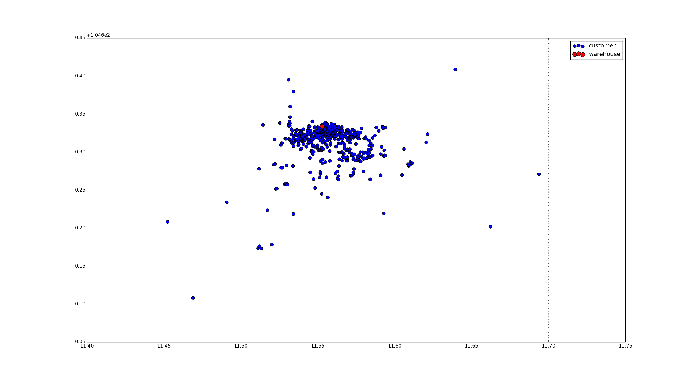

# Capacitated VRP - CVRP

## Problem Statement

The problem is mathematically formulated in the following way: We are given a list of locations *__N = 0 . . . n − 1__* . The location *__0__* is the warehouse location, where all of the vehicles start and end their routes. The remaining locations are customers. Each location is characterized by three values *__⟨di, xi, yi⟩ i ∈ N__* a demand *__di__* and a point *__xi,yi__*. The fleet of vehicles *__V = 0...v − 1__* is fixed and each vehicle has a limited capacity *__c__*. All of the demands assigned to a vehicle cannot exceed its capacity *__c__*. For each vehicle *__i ∈ V__*, let *__Ti__* be the sequence of customer deliveries made by that vehicle and let *__dist(c1, c2)__* be the Euclidean distance between two customers. Then the vehicle routing problem is formalized as the following optimization problem.

<a href="https://www.codecogs.com/eqnedit.php?latex=minimize:&space;\:&space;\sum_{i\in&space;V}^{}\right{(dist(0,T_{i})&space;&plus;&space;\sum_{<j,k>\in&space;T_{i}}^{}\right{dist(j,k)&plus;dist(T_{i,|T_{i}|-1},0}))}" target="_blank">\in&space;T_{i}}^{}\right{dist(j,k)&plus;dist(T_{i,|T_{i}|-1},0}))}" title="minimize: \: \sum_{i\in V}^{}\right{(dist(0,T_{i}) + \sum_{<j,k>\in T_{i}}^{}\right{dist(j,k)+dist(T_{i,|T_{i}|-1},0}))}" /></a>

&nbsp;&nbsp;&nbsp;&nbsp;&nbsp;&nbsp;&nbsp;&nbsp;&nbsp;&nbsp;&nbsp;&nbsp;&nbsp;&nbsp;&nbsp;&nbsp;&nbsp;&nbsp;&nbsp;&nbsp;

--------------------------------------------------------------------------------

## Example
Input data: [`./data/location.csv`](./data/locations.csv)
* Format: latitude,longitude,is_customer(0 or 1)
* Number of Locations(*__N__*) = 537
* Number of Vehicles(*__V__*) = 25
* For each location
  * Demand(*__di__*) = 1
* The capacity of the vehicle(*__c__*) = 21 ~ 25 (= 537 / 25)

## Proposed Solution
The vehicle routing problem (VRP) is a NP(Nondeterministic Polymomial-time) hard problem.
This project uses a heurisitic algorithm to solve this problem. The proposed algorithm consists of two phases:
1. Finds the centroids which will be delivered by each vehicle by using k-means clustering algorithm
2. Assigns the customers to each centroid(i.e. vehecle)
3. Optimize the vehicle routing(This is a TSP problem.)

### Plots the input data.

<nobr>

 
<table style="vertical-align:middle; text-align:center; border-collapse:collapse;">
<tr>
<td style="border:none"></td>
<td style="border:none"></td>
<tr>
<td style="border:none"></td>
<td style="border:none"></td>
</tr>
</table>

</nobr>

